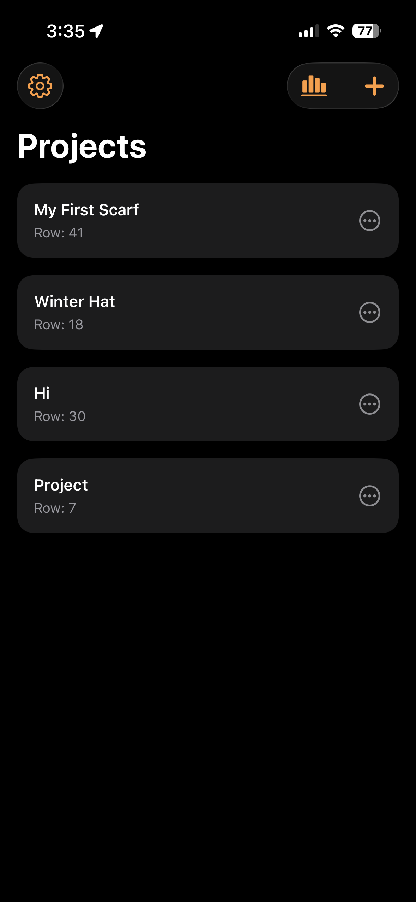
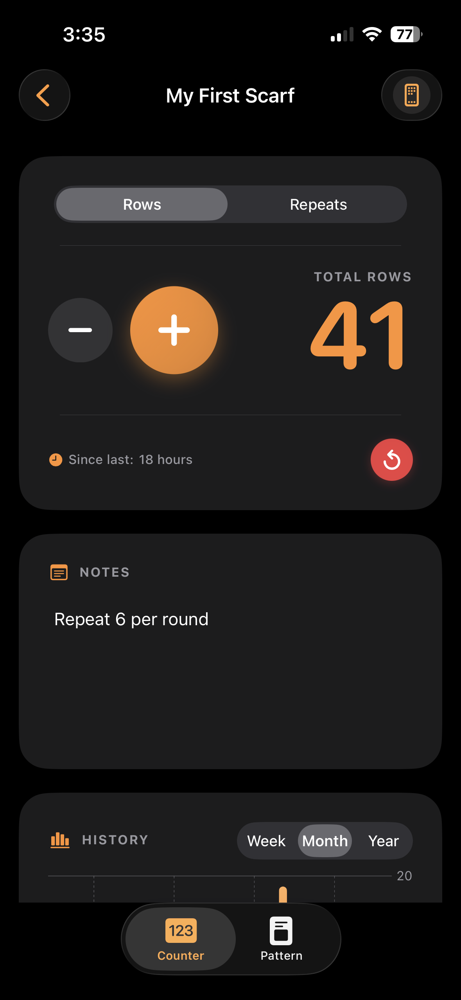
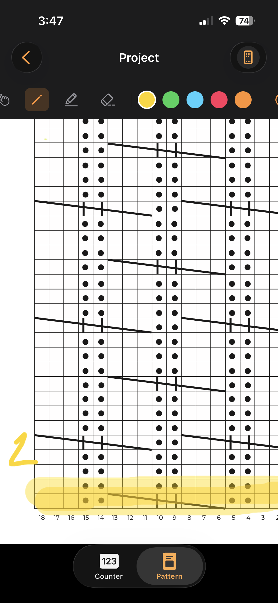

# Knit

Knit is an iOS knitting companion app with per-project row and repeat counters, notes, statistics (per-project and global), PDF pattern viewing with drawing/highlighting, and a lock screen Live Activity counter.

## Features

- Multiple knitting projects
- Row and repeat counters
- Notes per project
- Per-project history charts
- Global statistics across all projects
- PDF pattern import and viewing
- PDF pen and highlighter tools
- Lock screen Live Activity counter

## Screenshots

### Project List

Create and manage multiple knitting projects from one place. Each project has its own counter, notes, statistics, and pattern viewer.

### Counter, Notes, and Stats

Track rows or repeats, keep project-specific notes, and track your day-to-day progress.

### PDF Pattern Viewer

Import a pattern PDF to track while knitting. The viewer supports drawing and highlighting.

### Lock Screen Live Activity

Start a project counter from the app and control rows or repeats directly from the Lock Screen with a Live Activity.

## Requirements

I plan to make this easier in the future, but while the app is in active
development this is the best way to do it.

- Xcode 26 or newer
- An iPhone running a recent iOS version that supports Live Activities
- An Apple Developer account for on-device signing

# How To Upload and Sign

1. Open `Knit.xcodeproj`
2. Select the `Knit` project in the navigator
3. For both `Knit` and `KnitCounterWidget` targets:
4. Go to `Signing & Capabilities`
5. Enable `Automatically manage signing`
6. Choose your Apple Developer `Team`

The public copy uses placeholder identifiers, so change these in Xcode if needed:

- App bundle identifier: `com.example.Knit`
- Widget bundle identifier: `com.example.Knit.KnitCounterWidget`
- App Group: `group.com.example.Knit.shared`

The app target and the widget target must use the same App Group value.

## Enable Capabilities

For both `Knit` and `KnitCounterWidget`:

1. Open `Signing & Capabilities`
2. Add or confirm the `App Groups` capability
3. Add `group.com.example.Knit.shared`

For the app target:

1. Add or confirm the `Background Modes` and `Live Activities` related support if Xcode prompts for it

## Run On Device

1. Pick your iPhone as the run destination
2. Build and run the `Knit` target
3. Open a project
4. Use the top-right phone/widget button to start a Live Activity for that project

## Project Structure

- `Knit/` app source files
- `KnitCounterWidget/` Live Activity and widget extension files
- `Config/` extension Info.plist

## License

This project is licensed under the MIT License

See the `LICENSE` file for details

